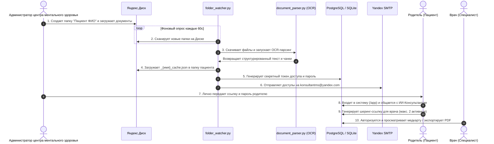
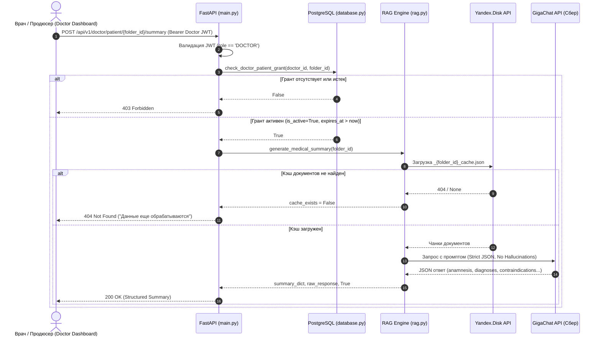
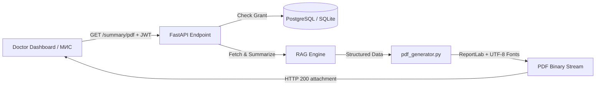

# ИИ-Консультант RAG API: Архитектура и Технический Канвас

## 🎯 Project Overview
«ИИ-Консультант RAG API» — высоконадежная платформа персонального медицинского ассистента на базе RAG (Retrieval-Augmented Generation) и открытого информационного портала клиники «Маленькая Страна».

---

## 🛠️ Tech Stack
- **Язык программирования:** Python 3.13
- **Веб-фреймворк:** FastAPI (Uvicorn, Starlette)
- **Шаблонизатор:** Jinja2
- **Веб-сервер / Reverse Proxy:** Nginx (Alpine) — кэширование статики 30d, проксирование бэкенда
- **Базы данных:** PostgreSQL 15 (Docker) / SQLite3 (локально)
- **Безопасность & Аутентификация:**
  - Stateless JWT (`PyJWT`, алгоритм `HS256`, время жизни токена 30 минут, `Bearer` авторизация)
  - Хэширование паролей (`bcrypt`)
  - Шифрование Data at Rest (`cryptography.fernet`)
- **API & Интеграции:**
  - GigaChat API (RAG-генерация ответов)
  - Yandex Disk API (облачное хранилище и кэш)
  - Yandex SMTP (уведомления)
- **Обработка данных & OCR:**
  - `pytesseract` + `tesseract-ocr-rus` (распознавание текста с изображений и сканов)
  - `PyMuPDF`, `pdf2image`, `poppler-utils`, `python-docx` (парсинг документов)

---

## 📁 Структура проекта

```text
antigravKONSYLTANT/
│
├── nginx/                      # Конфигурация Nginx Reverse Proxy
│   └── default.conf            # Роутинг /, /app/, прямое кэширование /static/
│
├── templates/                  # Jinja2 HTML шаблоны
│   └── index.html              # Главный лендинг (Hero, Персонажи Pixar, Услуги, Врачи, Блог)
│
├── static/                     # Статические ресурсы (прямая раздача Nginx)
│   ├── css/
│   │   └── style.css           # Стили темы (#1E1E2E, #7C3AED, #06B6D4)
│   ├── js/
│   │   ├── bubbles.js          # Canvas интерактивная анимация пузырьков снов
│   │   ├── voiceInput.js       # Клиентский Web Speech API контроллер голосового ввода
│   │   └── app.js              # Клиентский UI, Showcase персонажей, модалки, REST API клиент
│   ├── images/                 # 3D Pixar персонажи звуков (char_a.jpg ... char_y.jpg)
│   ├── audio/                  # Звуковые сэмплы инструментов (sound_a.mp3 ... sound_y.mp3)
│   ├── app.js                  # SPA-контроллер приватного чата пациента
│   └── index.html              # SPA-интерфейс приватного чата пациента (/app/)
│
├── main.py                     # Точка входа FastAPI (REST API, JWT Auth Middleware, роутинг)
├── database.py                 # Слой работы с БД (PostgreSQL / SQLite), автомиграции и индексы
├── security_utils.py           # Stateless JWT (генерация, валидация), маскирование и Rate Limiting
├── crypto_utils.py             # Data at Rest Encryption (Fernet) + реэкспорт security_utils
├── rag.py                      # RAG пайплайн (GigaChat API + изоляция контекста пациента)
├── folder_watcher.py           # Фоновый воркер синхронизации Яндекс.Диска и RAG-индексация
├── document_parser.py          # Гибридный парсер документов (DOCX, PDF, OCR Tesseract)
├── notification_service.py     # Yandex SMTP сервис рассылки доступов
├── alert_service.py            # Подсистема мониторинга 6 метрик надежности и оповещений о сбоях
├── pdf_generator.py            # ReportLab генератор клинических PDF-отчетов
├── Dockerfile                  # Контейнеризация Python 3.13 + Tesseract OCR + Poppler
└── docker-compose.yml          # Оркестрация Web + PostgreSQL 15 + Nginx + Certbot
```

---

## 🏥 БИЗНЕС-ПРОЦЕСС: ОБРАБОТКА МЕДИЦИНСКИХ ДОКУМЕНТОВ



1. **Загрузка документов:**
   - Администратор центра ментального здоровья создает персональную папку пациента на Яндекс.Диске (например, `disk:/Павлик Морозов`).
   - В эту папку загружаются медицинские заключения, выписки, результаты диагностики и сканы (PDF, DOCX, TXT, JPG, PNG).

2. **Автоматический фоновый парсинг (ETL):**
   - Фоновый процесс `folder_watcher.py` периодически опрашивает Яндекс.Диск через Yandex Disk API.
   - При обнаружении новой папки парсер `document_parser.py` извлекает текст из всех поддерживаемых файлов, используя Tesseract OCR для сканированных изображений.
   - Текст разбивается на смысловые чанки (chunking) с перекрытием (overlap).

3. **Формирование кэша (Knowledge Base):**
   - Сгенерированные чанки структурируются в JSON-файл кэша (например, `Павлик_Морозов_cache.json`).
   - Кэш-файл загружается обратно в ту же папку пациента на Яндекс.Диске, формируя изолированную базу знаний.

4. **Генерация учетных данных:**
   - Система генерирует уникальный криптографический токен доступа (`access_token`) и временный 12-значный пароль.
   - В таблице `patient_access` создается изолированная запись с привязкой:
     * `access_token` (уникальный токен входа)
     * `password_hash` (bcrypt-хэш пароля)
     * `gdrive_folder_id` (идентификатор папки пациента на Яндекс.Диске)
     * `role = 'PATIENT'`

5. **Передача доступов:**
   - Ссылка и пароль автоматически отправляются через защищенный SMTP на email: `konsultantms@yandex.com`.
   - Администратор **ЛИЧНО** передает сформированные доступы родителю ребенка.
   - Родитель авторизуется в системе и общается с персональным ИИ-Консультантом.

> 🔒 **АРХИТЕКТУРНЫЙ ПРИНЦИП:** Каждая папка пациента = строго изолированный контекст для RAG. Никакого cross-tenant доступа.

---

## 🇷🇺 АРХИТЕКТУРНЫЙ ИМПЕРАТИВ: ТЕХНОЛОГИЧЕСКИЙ СУВЕРЕНИТЕТ

> **ДИРЕКТИВА:** Система функционирует на 100% автономно на территории РФ, опираясь исключительно на отечественные облачные сервисы и локальный стек технологий.

### Матрица соответствия технологическому суверенитету (100% Отечественный стек):

| Сервис / Технология | Юрисдикция | Роль в системе | Статус суверенитета |
| :--- | :--- | :--- | :--- |
| **GigaChat API (Сбер)** | РФ | Основной RAG LLM провайдер | ✅ **100% РФ.** Сервера в РФ, полное соответствие 152-ФЗ. |
| **Yandex Disk API** | РФ | Облачное хранилище документов и RAG-кэша | ✅ **100% РФ.** Автономный ETL, защищенный OAuth. |
| **Yandex SMTP / UniSender** | РФ | Почтовые шлюзы уведомлений | ✅ **100% РФ.** TLS 465, независимость от зарубежных почтовиков. |
| **Tesseract OCR (Local)** | Локально (Docker) | Офлайн-распознавание сканов и диагнозов | ✅ **Автономно.** Работает полностью внутри контейнера без внешних вызовов. |
| **ReportLab (Local)** | Локально (Docker) | Генератор клинических PDF с шрифтами DejaVu | ✅ **Автономно.** Локальная сборка документов внутри контейнера. |
| **Google Drive API** | США | *Удалено из архитектуры* | ❌ **Деинсталлирован.** Все зависимости, credentials и код удалены. |

---

## 🏗️ System Architecture

1. **Edge / Reverse Proxy Layer (Nginx):**
   - Порт `80`, `443` -> Проксирование запросов к FastAPI (`http://web:8000`), SSL-терминация.
   - `/` -> Отдача SSR шаблона лендинга `templates/index.html`.
   - `/app/` -> Приватный SPA чат пациента.
   - `/static/` -> Прямая отдача CSS/JS/Images/Audio с заголовками кэширования на 30 дней.

2. **API & Security Layer (FastAPI):**
   - Stateless JWT-аутентификация: Защищенные эндпоинты `/api/chat` и `/api/patient/files` требуют заголовок `Authorization: Bearer <token>`.
   - Административная CMS-панель: Эндпоинты `/api/v1/admin/*` защищены JWT с верификацией роли `ADMIN`.
   - Кабинет врача (Doctor Portal): Эндпоинты `/api/v1/doctor/*` защищены JWT с верификацией роли `DOCTOR`.
   - Автоматический таймаут неактивности (30 минут).
   - Публичные REST API (`/api/v1/public/services`, `/doctors`, `/posts`, `/events`, `/leads`).
   - Домен: `цмз.site` (Punycode `xn--g1aj3a.site`, `www.xn--g1aj3a.site`), VPS IP `159.194.232.74`.

3. **Background ETL & Storage Layer:**
   - `folder_watcher.py` отслеживает появление медицинских карт на Яндекс.Диске.
   - `document_parser.py` извлекает текст (с поддержкой OCR и постраничной защитой от сбоев).
   - `rag.py` изолирует медицинский контекст строго в рамках разрешенной папки пациента (`allowed_folder`).
   - **ETL Folder Exclusion:** Исключение служебных и системных папок (`EXCLUDED_FOLDERS=Загрузки,Trash,Archive,Корзина`) от ошибочного сканирования и генерации доступов.
   - **Диагностический мониторинг:** Эндпоинт `GET /api/v1/admin/diagnose/folder/{folder_name}` для мгновенной проверки состояния папки в БД, наличия кэша и чтения логов ETL.

4. **Database Indexing & Query Optimization:**
   - **Автомиграция индексов (`ensure_indexes`):** При каждом старте `init_db()` проверяет и идемпотентно создает B-tree индексы в PostgreSQL и SQLite.
   - **Уникальные индексы токенов:** `idx_patient_access_token` на `patient_access(access_token)` и `idx_share_grants_token` на `patient_share_grants(share_token)` обеспечивают $O(\log N)$ валидацию токенов.
   - **Составные индексы (Composite Indexes):**
     - `idx_share_grants_patient_active` на `(patient_folder_id, is_active, expires_at)` для моментального подсчета активных ссылок.
     - `idx_patient_access_role_verified` на `(role, is_verified)` для выборки врачей.
     - `idx_public_leads_status_created` на `(status, created_at)` для фильтрации заявок в CMS.
   - **Индексы сортировки и внешних ключей:** `idx_public_posts_created_at`, `idx_share_grants_doctor_id`, `idx_doctors_license_number`.

5. **AI Clinical Summary Pipeline (RAG-суммаризация):**
   - Эндпоинт `POST /api/v1/doctor/patient/{patient_folder_id}/summary` генерирует структурированное резюме на базе чанков медкарты.
   - Строгая двухфакторная валидация: JWT роль `DOCTOR` + проверка активного TTL-гранта в `patient_share_grants`.



6. **Medical Report PDF Generation Engine (`pdf_generator.py`):**
   - **Эндпоинт:** `GET /api/v1/doctor/patient/{patient_folder_id}/summary/pdf`
   - **Конвейер формирования документа:**
     1. Врач запрашивает PDF через интерфейс или внешний МИС.
     2. FastAPI проверяет JWT роль `DOCTOR` и активный грант в `patient_share_grants`.
     3. RAG-движок (`rag.py`) формирует структурированное резюме пациента.
     4. `pdf_generator.py` компилирует профессиональный PDF с использованием ReportLab и UTF-8 шрифтов (`DejaVuSans`).
     5. Двухпроходный `NumberedCanvas` рассчитывает точное количество страниц (`Стр. X из Y`), рисует акцентную шапку клиники, карточки противопоказаний (`Alert Box`) и юридический дисклеймер.
     6. Сервер возвращает `Response(content=pdf_bytes, media_type="application/pdf")` с заголовком скачивания `Content-Disposition: attachment; filename="medical_summary_...pdf"`.



7. **Share Link Lifecycle & Limit Management:**
   - **Бизнес-правило:** Один пациент может иметь максимум **2 активные** шеринг-ссылки одновременно.
   - **Подсчет:** `count_active_shares(patient_folder_id)` обращается к составному индексу `idx_share_grants_patient_active` (`WHERE patient_folder_id = ? AND is_active = TRUE AND expires_at > NOW()`).
   - **Блокировка 3-й ссылки:** При `active_count >= 2` эндпоинт `POST /api/v1/patient/share` возвращает `HTTP 429 Too Many Requests` с понятным сообщением и метаданными (`{"active_count": 2, "max_allowed": 2}`).
   - **Отзыв (Revocation):** Эндпоинт `DELETE /api/v1/patient/share/{grant_id}` производит мягкое удаление (`is_active = FALSE`), моментально освобождая слот для создания новой ссылки.
   - **Список активных ссылок:** Эндпоинт `GET /api/v1/patient/shares` предоставляет список действующих доступов для рендеринга в SPA пациента.

8. **Observability: ETL Performance Metrics & LLM Token Accounting:**
   - **Метрики ETL (`etl_metrics`):**
     - Таблица технических метрик производительности: `folder_name`, `started_at`, `finished_at`, `duration_seconds`, `file_count`, `pages_processed`, `chunks_created`, `errors_count`, `avg_time_per_file_seconds`.
     - Не содержит PII и медицинских данных.
     - Административный эндпоинт `GET /api/v1/admin/etl/metrics` возвращает историю обработок и агрегаты (средняя скорость папки, средняя скорость файла, количество папок и файлов).
     - Поле `last_etl_metrics` в диагностическом эндпоинте `GET /api/v1/admin/diagnose/folder/{folder_name}`.
   - **Учет токенов LLM (`llm_usage`):**
     - Таблица учета токенов: `model`, `prompt_tokens`, `completion_tokens`, `total_tokens`, `request_type`, `created_at`.
     - Автоматическая фиксация блока `usage` после каждого запроса к GigaChat API (RAG-консультация, клиническое резюме).
     - Административный эндпоинт `GET /api/v1/admin/llm/usage` возвращает расход токенов за сегодня, 7 дней, 13 дней, все время, с разбивкой по моделям и типам запросов.
     - Интеграция с официальным методом Сбера `GET /balance` с graceful обработкой (`200 OK` для пакетных тарифов, `403 Pay-As-You-Go` для постоплаты) и расчетным контролем квоты через `GIGACHAT_PACKAGE_TOKENS_LIMIT` с предупреждением при $\ge 80\%$.

9. **Landing Page Architecture, Multimedia CMS & Admin Operations Panel:**
   - **Порядок секций главной страницы (`templates/index.html`):**
     1. Секция «Новые посты» (`#posts`) — **САМАЯ ПЕРВАЯ СЕКЦИЯ НА САЙТЕ (выше Hero-блока)** с динамической подгрузкой свежих статей из CMS, обложками и видео-бейджами
     2. Hero-блок («Детская вселенная: Маленькая страна» без слова «клиника» и «музыкальная», синхронизировано в title, meta description и Open Graph тегах)
     3. Секция «Полезная библиотека» (`#blog`) с фильтрацией по категориям и тегам
     4. Секция «Персонажи звуков» (`#characters`) — интерактивный Pixar-блок героев звуков с аудиотреками и описаниями
     5. Секция «О центре» (`#about`)
     6. Секция «Направления заботы» (`#services`)
     7. Секция «Волшебники Центра» (`#doctors`)
     8. Секция «События & Жизнь центра» (`#events`)
     9. Секция «Сообщество центра» (`#community-chat`) — открытый чат родителей, врачей и администрации.
     10. Секция «Особая забота» (`#special-care-section`)
     11. Секция «Контакты & Форма заявки» (`#contacts`)
     12. Подвал (`footer`)
   - **Локальное хранилище медиаконтента (Local Uploads & Static Nginx Volume):**
     - Таблицы `public_posts` и `public_library` используют поле `cover_image_url` (VARCHAR 500), `video_url` (VARCHAR 500), `attachments` (TEXT/JSON).
     - Эндпоинт `POST /api/v1/admin/upload` (JWT `ADMIN`) сохраняет файлы строго локально в `static/uploads/` без обращений к сторонним сервисам.
     - Для сохранения файлов между перезапусками контейнеров используется Docker Volume `uploads_data`, смонтированный в `web` и доступный `nginx` в режиме `ro` для быстрой прямой раздачи.
   - **Гибридный видеоплеер с двойной резервной ссылкой:**
     - Прямые файлы (`.mp4`, `.webm`) проигрываются через нативный HTML5 `<video controls poster="...">`.
     - Ссылки на внешние платформы (Rutube, VK Video, YouTube, Яндекс.Видео) трансформируются в безопасный встраиваемый `<iframe>` без автовоспроизведения.
     - Под каждым видеоплеером без исключений выводится текстовая ссылка «Смотреть на первоисточнике» с прямым переходом к оригинальному видео.
   - **Открытый чат сообщества на лендинге (`#community-chat`):**
     - Таблица `public_chat_messages` (`id`, `author_role`, `author_id`, `author_name`, `message_text`, `created_at`) с B-tree индексом `idx_public_chat_messages_created_at`.
     - Открытое чтение ленты (`GET /api/v1/public/chat`) без авторизации.
     - Отправка сообщений (`POST /api/v1/public/chat`) только для авторизованных пользователей любой роли (`PATIENT`, `DOCTOR`, `ADMIN`) с лимитом 10 сообщений в минуту.
     - Строгая цветовая маркировка авторов: родители — зеленым (`#34D399`), врачи — красным (`#F87171`), администрация — фиолетовым (`#C084FC`).
     - Три точки входа для авторизации (Родитель, Врач, Администратор) с модальным окном `#parent-modal`.
     - Административная модерация (`DELETE /api/v1/public/chat/{message_id}`).
     - Нулевой расход токенов ИИ: публичный чат предназначен для живого человеческого общения и не расходует квоты LLM.
   - **Кабинет врача (Doctor Portal & Clinical Notes):**
     - Таблица `doctor_notes` (`id`, `doctor_id`, `patient_folder_id`, `note_text`, `created_at`, `updated_at`) с индексом `idx_doctor_notes_doc_patient`.
     - Просмотр и скачивание оригинальных диагностических документов (`GET /api/v1/doctor/patient-records/{share_token}/document/{filename}`).
     - Клинический консилиум: генерация RAG-резюме со структурированными карточками (анамнез, диагнозы, противопоказания красным цветом, взаимодействия препаратов янтарным цветом, рекомендации) и скачивание отчета в формате PDF.
   - **Операционная панель администратора (Admin Operations Dashboard):**
     - Вкладка «Операционная панель» (`#admin-tab-ops`) в модальном окне CMS (`#admin-dashboard-modal`).
     - Запрашивает защищенные JWT эндпоинты `/api/v1/admin/etl/metrics`, `/api/v1/admin/llm/usage`, `/api/v1/admin/health/yandex-disk`.
     - Визуализирует карточки: статус и квота Яндекс.Диска, производительность ETL-пайплайна, расход токенов LLM по временным срезам и моделям, официальный баланс токенов Сбера.
     - Обеспечивает сквозную публикацию постов: сохранение в CMS мгновенно обновляет секцию «Новые посты» и «Полезная библиотека» на клиенте без redeploy.

10. **Система оповещений о критических сбоях и мониторинга (Alert Subsystem):**
    - **Фоновый Health-Check воркер (`alert_service.py`):** Запускается каждые 5 минут в фоновом потоке FastAPI (`lifespan`).
    - **Дублирование уведомлений:** Каждое оповещение отправляется одновременно на 2 адреса:
      - `PRIMARY_ALERT_EMAIL=konsultantms@yandex.com` (основной ящик)
      - `SECONDARY_ALERT_EMAIL=sergo123qwe321@gmail.com` (дублирующий ящик)
    - **Метрики и критические пороги срабатывания:**
      1. *Недоступность Яндекс.Диска:* Сбой API при обращении к квоте (`GET /v1/disk/`).
      2. *Недоступность GigaChat API:* $\ge 3$ последовательных ошибок запроса к LLM или ошибка получения OAuth-токена.
      3. *Падение фонового ETL-воркера `folder_watcher.py`:* Отсутствие обновления heartbeat более 10 минут (600 с).
      4. *Остаток токенов GigaChat:* Менее 20% от исходного пакета по любой из моделей.
      5. *Деградация скорости ETL:* Средняя скорость обработки превышает 15 секунд на файл.
      6. *Недоступность базы данных PostgreSQL:* Отсутствие подключения более 30 секунд.
    - **Механизм дедупликации и выздоровления:**
      - По каждой активной проблеме письмо отправляется не чаще 1 раза в час (дедупликация 3600 с).
      - При нормализации метрики система отправляет однократное письмо о выздоровлении (`✅ [ВЫЗДОРОВЛЕНИЕ] {Сервис} восстановлен`).
    - **Административный эндпоинт верификации:**
      - `POST /api/v1/admin/alerts/test` (JWT `ADMIN`) отправляет тестовое письмо на оба адреса для подтверждения работы почтовых шлюзов.
      - В CMS встроен интерактивный интерфейс проверки с отображением статуса всех 6 сервисов.

---

## 🛡️ Fault Tolerance, Security & Rate Limiting Policy
- **Rate Limiting (Защита от Brute-Force):**
  - Ограничение частоты запросов на endpoints авторизации (`/api/login`, `/api/v1/doctor/login`, `/api/v1/admin/login`).
  - Лимит: максимум 5 попыток в минуту с одного IP-адреса (с поддержкой `X-Forwarded-For`).
  - Период блокировки: 5 минут (300 секунд) с возвратом HTTP 429, заголовком `Retry-After: 300` и безопасным маскированием IP в логах (`mask_ip`).
  - Авто-сброс: при успешной авторизации (HTTP 200) счетчик неудачных попыток для IP сбрасывается.
  - Fail-Open стратегия: при непредвиденных сбоях ограничителя запросы пропускаются без блокировки пользователей.
- Ограничение времени (`timeout=60s`) на OCR-парсинг с постраничной изоляцией.
- Жесткие сетевые таймауты (`timeout=15s`) для внешних HTTP-запросов.
- Graceful Degradation: при сбоях GigaChat API возвращается понятная ошибка без падения сервиса.
- Mock-данные на фронтенде: лендинг сохраняет работоспособность даже при временной недоступности бэкенда.

---

## 🎙️ 11. ГОЛОСОВОЙ ВВОД (NATIVE WEB SPEECH API)

Для повышения доступности и удобства родителей в приватном чате пациента (`/app/`) реализована 100% клиентская подсистема голосового ввода:
- **Технологический суверенитет и приватность:** Аудиопоток распознается встроенным движком браузера без передачи аудиозаписей на сторонние облачные сервера.
- **Поддержка браузеров:** Chrome, Яндекс.Браузер, Safari, Edge (с автодетекцией через `isSpeechRecognitionSupported()` и выводом фоллбэк-подсказки для устаревших браузеров).
- **Режимы распознавания:**
  - `lang = 'ru-RU'` (русский язык по умолчанию);
  - `continuous = true` (непрерывный ввод до явной остановки);
  - `interimResults = true` (живое отображение промежуточной транскрипции в поле ввода).
- **Состояния кнопки микрофона:** Неактивна (серый), Идёт запись (пульсирующий красный индикатор с анимацией), Ошибка доступа (жёлтый статус с подсказкой).
- **Defensive UX:** Автоостановка при ручном вводе с клавиатуры, 60-секундный таймаут тишины, удержание фокуса в поле ввода для быстрой правки перед отправкой.

---

## 🚀 Roadmap & Status

### ✅ Phase 1: Infrastructure & Security Core (Завершена)
- [x] **Nginx Reverse Proxy:** Маршрутизация на 80 порту, изоляция сервиса web во внутренней сети Docker, привязка домена `цмз.site`.
- [x] **Data at Rest Encryption:** Модуль `crypto_utils.py` (Fernet) для шифрования медицинских данных.
- [x] **RBAC Foundation:** Таблицы ролей (`PATIENT`, `DOCTOR`, `ADMIN`) и таблица заявок `public_leads`.
- [x] **Stateless JWT Migration:** Полный отказ от серверной памяти сессий, время жизни токена 30 минут.

### ✅ Phase 2: Public Portal, Expert Blog & Admin CMS (Завершена)
- [x] **Модуляризация фронтенда:** Выделение `templates/index.html`, `style.css`, `bubbles.js`, `app.js`.
- [x] **Анимация снов (Bubbles):** Полноэкранный отзывчивый Canvas с градиентами и эффектом отталкивания курсора.
- [x] **Экспертный блог:** 3 практические статьи от нейропсихологов и логопедов, модальный просмотр статей.
- [x] **Сбор заявок (Leads):** Интерактивная форма записи родителей с валидацией и сохранением в БД.
- [x] **Административная CMS:** Веб-панель управления заявками клиентов и публикациями статей блога (CRUD).
- [x] **Интерактивный блок персонажей Pixar:** 6 героев звуков, анимация Pixar Bounce, звуковые эффекты инструментов.
- [x] **Отказоустойчивость UI:** Офлайн-моки и резервные эмодзи при отсутствии соединения.

### ✅ Phase 3: Doctor's Dashboard & Data Sharing (Завершена)
- [x] **Схема и API шеринга:** Таблицы `doctors`, `patient_share_grants`, эндпоинты `/api/v1/doctor/login`, `/api/v1/patient/share`, `/api/v1/doctor/patient-records/{share_token}`.
- [x] **UI кабинета врача & глубокие ссылки:** Полнофункциональный Doctor Dashboard (`#doctor-dashboard-modal`) с поддержкой deep-linking `?share_token=...`.
- [x] **UI шеринга в SPA пациента:** Модальное окно генерации временной ссылки (`#share-modal`) с выбором TTL и копированием в буфер.
- [x] **Rate Limiting & DB Indexes:** Защита авторизации от brute-force и B-tree индексы БД с автомиграцией.

### ✅ Phase 4: AI Enhancements, Medical Reports, Alerting & Voice (Завершена)
- [x] **Medical Analytics & Structured Summary:** Пайплайн клинической суммаризации на базе LLM (anamnesis, diagnoses, contraindications, drug_interactions).
- [x] **Medical Report PDF Generator (`pdf_generator.py`):** ReportLab генератор медицинских заключений с кириллицей DejaVuSans.
- [x] **Alert Subsystem & Health Monitoring (`alert_service.py`):** Фоновый мониторинг 6 сервисов, дублирование на 2 email, дедупликация и recovery.
- [x] **Voice-to-Text (`voiceInput.js`):** 100% клиентская интеграция Native Web Speech API в приватном чате пациента.

---

## 📋 12. ЧЕК-ЛИСТ ГОТОВНОСТИ К БОЕВОМУ ЗАПУСКУ (PRODUCTION LAUNCH CHECKLIST)

Перед переходом к обработке реальных медицинских документов пациентов выполнена комплексная верификация всех ключевых узлов платформы:
1. **ETL-конвейер & Автономия:** Воркер `folder_watcher` сканирует Яндекс.Диск каждые 60 секунд, гибридный парсер поддерживает DOCX, PDF и сканы с Tesseract OCR (средняя скорость 4 с/файл).
2. **Идемпотентный сидинг пациентов:** Разработан скрипт `scripts/admin/seed_production_patient.py`, позволяющий регистрировать реальных пациентов по имени папки как автоматически, так и вручную через CLI.
3. **Безопасность & RBAC:** Строгая изоляция пациентов (`allowed_folder`), проверка активных грантов шеринга (`patient_share_grants`) для врачей, генерация криптографических токенов `secrets.token_urlsafe(32)` и bcrypt-хэширование паролей.
4. **Защита от Brute-Force:** Включен Rate Limiter на всех эндпоинтах авторизации (`/api/v1/doctor/login`, `/api/v1/admin/login`, `/api/verify-token`) с лимитом 5 попыток/мин и маскированием IP.
5. **Дублирование оповещений:** Все оповещения о сбоях и критических событиях дублируются на два адреса (`konsultantms@yandex.com` и `sergo123qwe321@gmail.com`) с механизмом часовой дедупликации.
6. **Инструкции для Продюсера:** Создан документ `PRODUCTION_LAUNCH.md` с регламентом загрузки папок, мониторинга и экстренного реагирования.

---

## 🛡️ 13. РЕЛИЗ v7.1-PRODUCTION: БЕЗОПАСНОСТЬ, 152-ФЗ, МОДЕРАЦИЯ И АНАЛИЗЫ

### 1. Архитектурный отказ от локального хранения медиа-файлов
- Сервер не хранит пользовательские изображения и видеоролики на диске.
- В БД сохраняются исключительно валидированные внешние URL-адреса.
- Разрешенный белый список видеоплатформ: `rutube.ru`, `vkvideo.ru`, `vk.com`, `dzen.ru`, `youtube.com`, `youtu.be`, `video.yandex.ru`.
- Разрешенный белый список хостингов изображений: `yandex.ru/images`, `images.yandex.ru`, `avatars.mds.yandex.net`, `vk.com`, `pikabu.ru`, `imgur.com`, `ibb.co`.
- Блокировка опасных схем (`javascript:`, `data:`, `file:`) и сервисов сокращения ссылок (`bit.ly`, `tinyurl.com`, `clck.ru`, `goo.gl`, `t.co`, `is.gd`, `cutt.ly`).
- Эндпоинт валидации: `POST /api/v1/admin/media-url` (JWT `ADMIN`).

### 2. История диалогов с ИИ-Консультантом (152-ФЗ)
- Таблицы: `patient_chat_history`, `doctor_chat_history` с индексами `idx_patient_chat_folder_created` и `idx_doctor_chat_doctor_patient`.
- Автоматическая фиксация каждого вопроса родителя и ответа ИИ с расходом токенов.
- Эндпоинты: `GET /api/patient/chat/history`, `GET /api/v1/doctor/patient/{patient_folder_id}/chat/history`, `DELETE /api/v1/admin/chat/history/patient/{patient_folder_id}` (право на забвение).
- Автоматическая подгрузка предыдущих сообщений в интерфейсе `/app/` при входе пациента.

### 3. Комплексная безопасность и модерация открытого чата сообщества
- **Мат-фильтр:** Проверка корневой нецензурной лексики на русском языке. При обнаружении — HTTP 400.
- **Сохранение номеров телефонов:** Поддержка формата `+7/8 (XXX) XXX-XX-XX` для связи родителей.
- **Очередь модерации внешних ссылок:**
  - Ссылки из белого списка публикуются сразу (`is_approved = True`).
  - Сторонние ссылки заменяются заглушкой `[ссылка ожидает проверки модератором]` (`is_approved = False`) и отправляются в очередь модерации (`GET /api/v1/admin/chat/moderation`).
  - Админ-панель: кнопки «Одобрить», «Удалить», «Забанить автора на 24ч».
- **Система жалоб сообщества:** `POST /api/v1/public/chat/{id}/report`. При накоплении 3+ жалоб от разных пользователей автор автоматически блокируется на 24 часа в таблице `banned_users`, а сообщение скрывается.
- **Модальное окно предупреждения:** При клике на любую внешнюю ссылку всплывает диалоговое предупреждение с кнопками «Перейти» и «Отмена».
- **Песочница и безопасность тегов:** Атрибуты `rel="noopener noreferrer ugc"` для всех ссылок и `sandbox="allow-scripts allow-same-origin"` для iframe.

### 4. Генерация хронологии анализов в кабинете врача
- **RAG-экстрактор (`rag.py`):** Извлечение лабораторных и инструментальных показателей (Гемоглобин, Ферритин, Витамин D, ЭЭГ и др.) с датами, нормами и комментариями.
- **Группировка и динамика:** Определение повторных анализов и расчет динамики изменений (`↑`, `↓`, `→`).
- **Генератор DOCX на лету (`analyses_generator.py`):** Генерация брендированного документа `.docx` с выделением отклонений красным цветом и динамических трендов.
- **Хранение в БД:** Таблица `patient_analyses_documents` хранит структурированный JSON без сохранения docx-файлов на диске.
- **Эндпоинты:** `POST .../generate-analyses`, `GET .../analyses`, `GET .../analyses/{doc_id}/preview`, `GET .../analyses/{doc_id}/download`, `DELETE .../analyses/{doc_id}`.
- **Интерфейс:** Кнопка «Сформировать анализы 📊», предпросмотр в браузере, скачивание DOCX и история выписок.

### 5. Подсистема онбординга врачей и открытый гостевой чат сообщества
- **Гостевой доступ в открытый диалог (`POST /api/v1/public/chat`):**
  - Неавторизованные пользователи могут отправлять сообщения без предварительного входа (`author_role = 'GUEST'`, `author_id = NULL`, опциональное поле `author_name`).
  - **Guest Rate Limiter:** Защита от спама на основе `InMemoryAuthRateLimiter(max_requests=3, window_seconds=3600, lockout_seconds=3600)` с IP-трекингом (HTTP 429 Too Many Requests с заголовком `Retry-After`).
  - Авторизованные пользователи (PATIENT, DOCTOR, ADMIN) защищены стандартным лимитером (10 сообщ/мин) и не блокируются гостевым лимитом.
  - Визуализация в интерфейсе: нейтрально-серый бейдж роли `⚪ Гость` (`#9CA3AF`).
- **Онбординг специалистов клинического центра:**
  - **API:** `POST /api/v1/admin/doctors` (JWT `ADMIN`), `GET /api/v1/admin/doctors`.
  - **Валидация:** Проверка обязательных полей (ФИО, Специализация, Email по regex-маске) и уникальности email.
  - **Генерация реквизитов:** Автоматическая генерация номера лицензии `DOC-XXXXXX` и криптографически стойкого временного пароля (12 символов).
  - **Хэширование:** `bcrypt.hashpw` с сохранением в таблицу `doctors` (`is_verified = True`).
  - **Email-сервис (`notification_service.py`):** Функция `send_doctor_onboarding_email` формирует брендированный HTML-шаблон с реквизитами доступа, прямой ссылкой `https://цмз.site/#doctor`, рекомендацией смены пароля и регламентом соблюдения 152-ФЗ / врачебной тайны; отправляет через Yandex SMTP (SSL 465) с обязательным дублированием копии на `PRIMARY_ALERT_EMAIL`.
  - **CMS Администратора (`#admin-dashboard-modal`):** Вкладка `#admin-tab-doctors` («🩺 Специалисты и врачи») с формой регистрации, живым счетчиком и интерактивным реестром действующих специалистов.
  - **CLI-утилита (`scripts/admin/register_doctor.py`):** Регистрация врачей из терминала с поддержкой аргументов `--name`, `--specialty`, `--email`, `--license`, `--phone` и интерактивным режимом `input()`.

### 6. Релиз v7.2-stable-uat-verified: Стабилизация UAT и отказоустойчивость почтовых шлюзов
1. **Изоляция и FLIP-анимация плавающего персонажа «Алик» (`static/js/app.js`):**
   - Точная привязка `IntersectionObserver` строго к Hero-секции (`#hero` / `.hero`) взамен нестабильных числовых порогов скролла (`scrollY < 220`).
   - Изоляция жизненного цикла виджета `#floating-alik-widget`: анимация перехода в плавающее состояние активируется только при уходе Hero за верхний край экрана (`boundingClientRect.top < 0`), а при скролле выше Hero (секция `#posts`) виджет скрывается.
   - Устранено влияние витрины `#characters` на Hero-персонажа.
   - FLIP-анимация (First, Last, Invert, Play) на аппаратных GPU-свойствах `transform`/`opacity` с мгновенным безопасным фоллбэком при `document.hidden` или нулевых размерах.

2. **Безусловный HTTPS-редирект в Nginx для Web Speech API (`nginx/default.conf`):**
   - На порту 80 настроен безусловный 301-редирект (`return 301 https://$host$request_uri;`) с сохранением пути верификации сертификатов Let's Encrypt (`location /.well-known/acme-challenge/`).
   - В блоке `listen 443 ssl` передаются заголовки `proxy_set_header X-Forwarded-Proto https;`, `X-Forwarded-For` и `Host`. Это обеспечивает Secure Context в браузерах и гарантирует стабильную доступность `window.SpeechRecognition` / `window.webkitSpeechRecognition`.
   - В контроллере `VoiceInputController` (`static/js/voiceInput.js`) внедрен сброс ошибок при повторном клике по микрофону, защита от Race Condition (`InvalidStateError`) и динамическая перепривязка DOM в `static/app.js`.

3. **Двухуровневый каскад отправки транзакционных писем онбординга (`notification_service.py`):**
   - Нормализовано считывание всех почтовых переменных окружения через `os.getenv("VAR") or "default"` с обрезкой пробелов (`.strip()`), предотвращающее сбои из-за пустых строк `""` в `.env`.
   - Зафиксированы дефолтные адреса: `PRIMARY_ALERT_EMAIL = "konsultantms@yandex.com"`, `SECONDARY_ALERT_EMAIL = "sergo123qwe321@gmail.com"`.
   - В `send_doctor_onboarding_email`, `send_email_to_recipient` и `send_dual_email` реализован отказоустойчивый каскад доставки:
     * **Primary Transport:** Yandex SMTP (SSL 465, таймаут 15 с).
     * **Fallback Transport:** UniSender API (HTTPS REST), вызываемый автоматически при любых сбоях SMTP (`socket.timeout`, `SMTPException`, `ConnectionRefusedError`, `OSError`) с логированием `[EMAIL FALLBACK]`.
     * Дублирование корпоративной копии на `PRIMARY_ALERT_EMAIL` также переведено на каскадную доставку.

4. **Актуальный тестовый набор и статус:**
   - **108 модульных и интеграционных тестов (100% PASS)**, верифицированных локально и в Production-контейнере `konsyltant_web` под PostgreSQL 16 и Nginx.
   - Контрольная точка отката зафиксирована в Git-теге `v7.2-stable-uat-verified`.

### 7. Подсистема автоматизированного резервного копирования БД и CMS UI (152-ФЗ)
1. **Модуль резервного копирования и CLI (`scripts/admin/backup_db.py`):**
   - Автономное создание сжатых дампов `backup_konsyltant_%Y%m%d_%H%M%S.sql.gz` через нативный `pg_dump` или fallback-экспорт через `psycopg2` (с поддержкой SQLite `iterdump` в dev-окружении).
   - Политика удержания (Retention Policy): хранение последних 7 дампов / дампов за 7 дней с авторотацией и гарантированным сохранением как минимум 1 актуального архива.
   - Изоляция хранилища дампов в `.gitignore` (`backups/*`, `!backups/.gitkeep`, `*.sql.gz`, `*.dump`).
2. **Административный REST API (`main.py`):**
   - `POST /api/v1/admin/backup` — инициация резервного копирования администратором (Stateless JWT с ролью `ADMIN`, флаги `retention_days`, `max_backups`, `dry_run`).
   - `GET /api/v1/admin/backups` — получение списка всех доступных дампов с размерами и датами.
3. **Веб-интерфейс в CMS Администратора (`templates/index.html`, `static/js/app.js`):**
   - Карточка «Резервное копирование БД (152-ФЗ)» во вкладке `#admin-tab-ops` с кнопкой «📦 Создать резервный снимок», индикатором процесса создания и списком архивов.
   - Клиентские методы `loadAdminBackups()` и `handleCreateBackup()`.
4. **Тестовый сьют:** 115 тестов со 100% прохождением (115/115 PASS).
