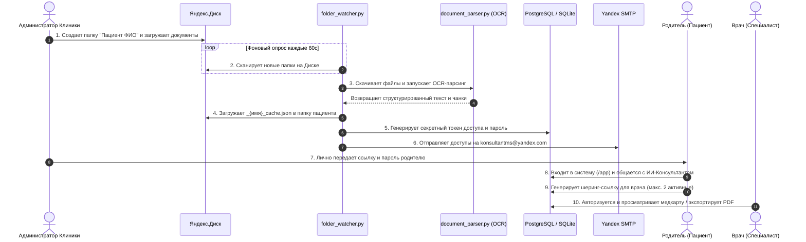
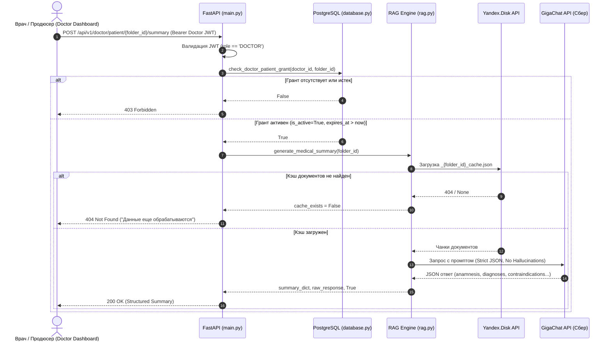
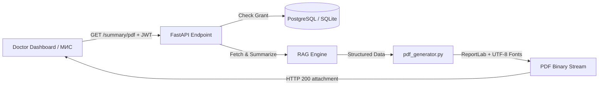

# ИИ-Консультант RAG API: Архитектура и Технический Канвас

## 🎯 Project Overview
«ИИ-Консультант RAG API» — высоконадежная платформа персонального медицинского ассистента на базе RAG (Retrieval-Augmented Generation) и открытого информационного портала клиники «Маленькая Страна».

---

## 🛠️ Tech Stack
- **Язык программирования:** Python 3.13
- **Веб-фреймворк:** FastAPI (Uvicorn, Starlette)
- **Шаблонизатор:** Jinja2
- **Веб-сервер / Reverse Proxy:** Nginx (Alpine) — кэширование статики 30d, проксирование бэкенда
- **Базы данных:** PostgreSQL 15 (Docker) / SQLite3 (локально)
- **Безопасность & Аутентификация:**
  - Stateless JWT (`PyJWT`, алгоритм `HS256`, время жизни токена 30 минут, `Bearer` авторизация)
  - Хэширование паролей (`bcrypt`)
  - Шифрование Data at Rest (`cryptography.fernet`)
- **API & Интеграции:**
  - GigaChat API (RAG-генерация ответов)
  - Yandex Disk API (облачное хранилище и кэш)
  - Google Drive API (резервный источник)
  - Yandex SMTP (уведомления)
- **Обработка данных & OCR:**
  - `pytesseract` + `tesseract-ocr-rus` (распознавание текста с изображений и сканов)
  - `PyMuPDF`, `pdf2image`, `poppler-utils`, `python-docx` (парсинг документов)

---

## 📁 Структура проекта

```text
antigravKONSYLTANT/
│
├── nginx/                      # Конфигурация Nginx Reverse Proxy
│   └── default.conf            # Роутинг /, /app/, прямое кэширование /static/
│
├── templates/                  # Jinja2 HTML шаблоны
│   └── index.html              # Главный лендинг (Hero, Персонажи Pixar, Услуги, Врачи, Блог)
│
├── static/                     # Статические ресурсы (прямая раздача Nginx)
│   ├── css/
│   │   └── style.css           # Стили темы клиники (#1E1E2E, #7C3AED, #06B6D4)
│   ├── js/
│   │   ├── bubbles.js          # Canvas интерактивная анимация пузырьков снов
│   │   └── app.js              # Клиентский UI, Showcase персонажей, модалки, REST API клиент
│   ├── images/                 # 3D Pixar персонажи звуков (char_a.jpg ... char_y.jpg)
│   ├── audio/                  # Звуковые сэмплы инструментов (sound_a.mp3 ... sound_y.mp3)
│   └── index.html              # SPA-интерфейс приватного чата пациента (/app/)
│
├── main.py                     # Точка входа FastAPI (REST API, JWT Auth Middleware, роутинг)
├── database.py                 # Схема PostgreSQL/SQLite, RBAC, Seeding тестовых данных
├── security_utils.py           # Stateless JWT (генерация, валидация, проверка TTL)
├── crypto_utils.py             # Data at Rest Encryption (Fernet) + реэкспорт security_utils
├── rag.py                      # RAG пайплайн (GigaChat API + изоляция контекста пациента)
├── folder_watcher.py           # Фоновый воркер синхронизации Яндекс.Диска
├── document_parser.py          # Гибридный парсер документов (DOCX, PDF, OCR Tesseract)
├── notification_service.py     # Yandex SMTP сервис рассылки доступов
│
├── Dockerfile                  # Контейнеризация Python 3.13 + Tesseract OCR + Poppler
│   └── audio/                  # Локальные звуки персонажей
│
├── document_parser.py          # Модуль парсинга документов (PDF, DOCX, TXT, OCR)
├── folder_watcher.py           # Фоновый мониторинг папок Яндекс.Диска и RAG-индексация
├── rag.py                      # RAG-пайплайн и интеграция с GigaChat API
├── pdf_generator.py            # ReportLab генератор клинических PDF-отчетов
├── security_utils.py           # JWT Stateless Sessions, маскирование и Rate Limiting
├── database.py                 # Слой работы с БД (PostgreSQL / SQLite) и автомиграции
├── main.py                     # Основное FastAPI приложение
└── Dockerfile                  # Production Dockerfile
```

---

## 🏥 БИЗНЕС-ПРОЦЕСС: ОБРАБОТКА МЕДИЦИНСКИХ ДОКУМЕНТОВ



1. **Загрузка документов:**
   - Администратор клиники создает персональную папку пациента на Яндекс.Диске (например, `disk:/Павлик Морозов`).
   - В эту папку загружаются медицинские заключения, выписки, результаты диагностики и сканы (PDF, DOCX, TXT, JPG, PNG).

2. **Автоматический фоновый парсинг (ETL):**
   - Фоновый процесс `folder_watcher.py` периодически опрашивает Яндекс.Диск через Yandex Disk API.
   - При обнаружении новой папки парсер `document_parser.py` извлекает текст из всех поддерживаемых файлов, используя Tesseract OCR для сканированных изображений.
   - Текст разбивается на смысловые чанки (chunking) с перекрытием (overlap).

3. **Формирование кэша (Knowledge Base):**
   - Сгенерированные чанки структурируются в JSON-файл кэша (например, `Павлик_Морозов_cache.json`).
   - Кэш-файл загружается обратно в ту же папку пациента на Яндекс.Диске, формируя изолированную базу знаний.

4. **Генерация учетных данных:**
   - Система генерирует уникальный криптографический токен доступа (`access_token`) и временный 12-значный пароль.
   - В таблице `patient_access` создается изолированная запись с привязкой:
     * `access_token` (уникальный токен входа)
     * `password_hash` (bcrypt-хэш пароля)
     * `gdrive_folder_id` (идентификатор папки пациента на Яндекс.Диске)
     * `role = 'PATIENT'`

5. **Передача доступов:**
   - Ссылка и пароль автоматически отправляются через защищенный SMTP на email: `konsultantms@yandex.com`.
   - Администратор **ЛИЧНО** передает сформированные доступы родителю ребенка.
   - Родитель авторизуется в системе и общается с персональным ИИ-Консультантом.

> 🔒 **АРХИТЕКТУРНЫЙ ПРИНЦИП:** Каждая папка пациента = строго изолированный контекст для RAG. Никакого cross-tenant доступа.

---

## 🇷🇺 АРХИТЕКТУРНЫЙ ИМПЕРАТИВ: ТЕХНОЛОГИЧЕСКИЙ СУВЕРЕНИТЕТ

> **ДИРЕКТИВА:** Система функционирует на 100% автономно на территории РФ без использования VPN и обходных прокси, опираясь исключительно на отечественные облачные сервисы и локальный стек технологий.

### Матрица соответствия технологическому суверенитету (100% Отечественный стек):

| Сервис / Технология | Юрисдикция | Роль в системе | Статус суверенитета |
| :--- | :--- | :--- | :--- |
| **GigaChat API (Сбер)** | РФ | Основной RAG LLM провайдер | ✅ **100% РФ.** Сервера в РФ, полное соответствие 152-ФЗ. |
| **Yandex Disk API** | РФ | Облачное хранилище документов и RAG-кэша | ✅ **100% РФ.** Автономный ETL, защищенный OAuth. |
| **Yandex SMTP / UniSender** | РФ | Почтовые шлюзы уведомлений | ✅ **100% РФ.** TLS 465, независимость от зарубежных почтовиков. |
| **Tesseract OCR (Local)** | Локально (Docker) | Офлайн-распознавание сканов и диагнозов | ✅ **Автономно.** Работает полностью внутри контейнера без внешних вызовов. |
| **ReportLab (Local)** | Локально (Docker) | Генератор клинических PDF с шрифтами DejaVu | ✅ **Автономно.** Локальная сборка документов внутри контейнера. |
| **Google Drive API** | США | *Удалено из архитектуры* | ❌ **Деинсталлирован.** Все зависимости, credentials и код удалены. |

---

## 🏗️ System Architecture

1. **Edge / Reverse Proxy Layer (Nginx):**
   - Порт `80`, `443` -> Проксирование запросов к FastAPI (`http://web:8000`), SSL-терминация.
   - `/` -> Отдача SSR шаблона лендинга `templates/index.html`.
   - `/app/` -> Приватный SPA чат пациента.
   - `/static/` -> Прямая отдача CSS/JS/Images/Audio с заголовками кэширования на 30 дней.

2. **API & Security Layer (FastAPI):**
   - Stateless JWT-аутентификация: Защищенные эндпоинты `/api/chat` и `/api/patient/files` требуют заголовок `Authorization: Bearer <token>`.
   - Административная CMS-панель: Эндпоинты `/api/v1/admin/*` защищены JWT с верификацией роли `ADMIN`.
   - Кабинет врача (Doctor Portal): Эндпоинты `/api/v1/doctor/*` защищены JWT с верификацией роли `DOCTOR`.
   - Автоматический таймаут неактивности (30 минут).
   - Публичные REST API (`/api/v1/public/services`, `/doctors`, `/posts`, `/events`, `/leads`).
   - Домен: `цмз.site` (Punycode `xn--g1aj3a.site`, `www.xn--g1aj3a.site`), VPS IP `159.194.232.74`.

3. **Background ETL & Storage Layer:**
   - `folder_watcher.py` отслеживает появление медицинских карт на Яндекс.Диске.
   - `document_parser.py` извлекает текст (с поддержкой OCR и постраничной защитой от сбоев).
   - `rag.py` изолирует медицинский контекст строго в рамках разрешенной папки пациента (`allowed_folder`).
   - **ETL Folder Exclusion:** Исключение служебных и системных папок (`EXCLUDED_FOLDERS=Загрузки,Trash,Archive,Корзина`) от ошибочного сканирования и генерации доступов.
   - **Диагностический мониторинг:** Эндпоинт `GET /api/v1/admin/diagnose/folder/{folder_name}` для мгновенной проверки состояния папки в БД, наличия кэша и чтения логов ETL.

4. **Database Indexing & Query Optimization:**
   - **Автомиграция индексов (`ensure_indexes`):** При каждом старте `init_db()` проверяет и идемпотентно создает B-tree индексы в PostgreSQL и SQLite.
   - **Уникальные индексы токенов:** `idx_patient_access_token` на `patient_access(access_token)` и `idx_share_grants_token` на `patient_share_grants(share_token)` обеспечивают $O(\log N)$ валидацию токенов.
   - **Составные индексы (Composite Indexes):**
     - `idx_share_grants_patient_active` на `(patient_folder_id, is_active, expires_at)` для моментального подсчета активных ссылок.
     - `idx_patient_access_role_verified` на `(role, is_verified)` для выборки врачей.
     - `idx_public_leads_status_created` на `(status, created_at)` для фильтрации заявок в CMS.
   - **Индексы сортировки и внешних ключей:** `idx_public_posts_created_at`, `idx_share_grants_doctor_id`, `idx_doctors_license_number`.

5. **AI Clinical Summary Pipeline (RAG-суммаризация):**
   - Эндпоинт `POST /api/v1/doctor/patient/{patient_folder_id}/summary` генерирует структурированное резюме на базе чанков медкарты.
   - Строгая двухфакторная валидация: JWT роль `DOCTOR` + проверка активного TTL-гранта в `patient_share_grants`.



6. **Medical Report PDF Generation Engine (`pdf_generator.py`):**
   - **Эндпоинт:** `GET /api/v1/doctor/patient/{patient_folder_id}/summary/pdf`
   - **Конвейер формирования документа:**
     1. Врач запрашивает PDF через интерфейс или внешний МИС.
     2. FastAPI проверяет JWT роль `DOCTOR` и активный грант в `patient_share_grants`.
     3. RAG-движок (`rag.py`) формирует структурированное резюме пациента.
     4. `pdf_generator.py` компилирует профессиональный PDF с использованием ReportLab и UTF-8 шрифтов (`DejaVuSans`).
     5. Двухпроходный `NumberedCanvas` рассчитывает точное количество страниц (`Стр. X из Y`), рисует акцентную шапку клиники, карточки противопоказаний (`Alert Box`) и юридический дисклеймер.
     6. Сервер возвращает `Response(content=pdf_bytes, media_type="application/pdf")` с заголовком скачивания `Content-Disposition: attachment; filename="medical_summary_...pdf"`.



7. **Share Link Lifecycle & Limit Management:**
   - **Бизнес-правило:** Один пациент может иметь максимум **2 активные** шеринг-ссылки одновременно.
   - **Подсчет:** `count_active_shares(patient_folder_id)` обращается к составному индексу `idx_share_grants_patient_active` (`WHERE patient_folder_id = ? AND is_active = TRUE AND expires_at > NOW()`).
   - **Блокировка 3-й ссылки:** При `active_count >= 2` эндпоинт `POST /api/v1/patient/share` возвращает `HTTP 429 Too Many Requests` с понятным сообщением и метаданными (`{"active_count": 2, "max_allowed": 2}`).
   - **Отзыв (Revocation):** Эндпоинт `DELETE /api/v1/patient/share/{grant_id}` производит мягкое удаление (`is_active = FALSE`), моментально освобождая слот для создания новой ссылки.
   - **Список активных ссылок:** Эндпоинт `GET /api/v1/patient/shares` предоставляет список действующих доступов для рендеринга в SPA пациента.

8. **Observability: ETL Performance Metrics & LLM Token Accounting:**
   - **Метрики ETL (`etl_metrics`):**
     - Таблица технических метрик производительности: `folder_name`, `started_at`, `finished_at`, `duration_seconds`, `file_count`, `pages_processed`, `chunks_created`, `errors_count`, `avg_time_per_file_seconds`.
     - Не содержит PII и медицинских данных.
     - Административный эндпоинт `GET /api/v1/admin/etl/metrics` возвращает историю обработок и агрегаты (средняя скорость папки, средняя скорость файла, количество папок и файлов).
     - Поле `last_etl_metrics` в диагностическом эндпоинте `GET /api/v1/admin/diagnose/folder/{folder_name}`.
   - **Учет токенов LLM (`llm_usage`):**
     - Таблица учета токенов: `model`, `prompt_tokens`, `completion_tokens`, `total_tokens`, `request_type`, `created_at`.
     - Автоматическая фиксация блока `usage` после каждого запроса к GigaChat API (RAG-консультация, клиническое резюме).
     - Административный эндпоинт `GET /api/v1/admin/llm/usage` возвращает расход токенов за сегодня, 7 дней, 13 дней, все время, с разбивкой по моделям и типам запросов.
     - Интеграция с официальным методом Сбера `GET /balance` с graceful обработкой (`200 OK` для пакетных тарифов, `403 Pay-As-You-Go` для постоплаты) и расчетным контролем квоты через `GIGACHAT_PACKAGE_TOKENS_LIMIT` с предупреждением при $\ge 80\%$.

9. **Landing Page Architecture & Admin Operations Panel:**
   - **Порядок секций главной страницы (`templates/index.html`):**
     1. Hero-блок («Детская вселенная: Маленькая страна» без слова «музыкальная», синхронизировано в title, meta description и Open Graph тегах)
     2. Секция «Новые посты» (`#posts`) с динамической подгрузкой свежих статей из CMS, отсортированных по индексу `created_at DESC`
     3. Секция «Полезная библиотека» (`#blog`) с фильтрацией по категориям и тегам
     4. Секция «Персонажи звуков» (`#characters`) — интерактивный Pixar-блок героев звуков с аудиотреками и описаниями
     5. Секция «О центре» (`#about`)
     6. Секция «Направления заботы» (`#services`)
     7. Секция «Волшебники Центра» (`#doctors`)
     8. Секция «События & Жизнь центра» (`#events`)
     9. Секция «Особая забота» (`#special-care-section`)
     10. Секция «Контакты & Форма заявки» (`#contacts`)
     11. Подвал (`footer`)
   - **Операционная панель администратора (Admin Operations Dashboard):**
     - Вкладка «Операционная панель» (`#admin-tab-ops`) в модальном окне CMS (`#admin-dashboard-modal`).
     - Запрашивает защищенные JWT эндпоинты `/api/v1/admin/etl/metrics`, `/api/v1/admin/llm/usage`, `/api/v1/health/yandex-disk`.
     - Визуализирует карточки: статус и квота Яндекс.Диска, производительность ETL-пайплайна, расход токенов LLM по временным срезам и моделям, официальный баланс токенов Сбера.
     - Обеспечивает сквозную публикацию постов: сохранение в CMS мгновенно обновляет секцию «Новые посты» и «Полезная библиотека» на клиенте без redeploy.

---

## 🛡️ Fault Tolerance, Security & Rate Limiting Policy
- **Rate Limiting (Защита от Brute-Force):**
  - Ограничение частоты запросов на endpoints авторизации (`/api/login`, `/api/v1/doctor/login`, `/api/v1/admin/login`).
  - Лимит: максимум 5 попыток в минуту с одного IP-адреса (с поддержкой `X-Forwarded-For`).
  - Период блокировки: 5 минут (300 секунд) с возвратом HTTP 429, заголовком `Retry-After: 300` и безопасным маскированием IP в логах (`mask_ip`).
  - Авто-сброс: при успешной авторизации (HTTP 200) счетчик неудачных попыток для IP сбрасывается.
  - Fail-Open стратегия: при непредвиденных сбоях ограничителя запросы пропускаются без блокировки пользователей.
- Ограничение времени (`timeout=60s`) на OCR-парсинг с постраничной изоляцией.
- Жесткие сетевые таймауты (`timeout=15s`) для внешних HTTP-запросов.
- Graceful Degradation: при сбоях GigaChat API возвращается понятная ошибка без падения сервиса.
- Mock-данные на фронтенде: лендинг сохраняет работоспособность даже при временной недоступности бэкенда.

---

## 🚀 Roadmap & Status

### ✅ Phase 1: Infrastructure & Security Core (Завершена)
- [x] **Nginx Reverse Proxy:** Маршрутизация на 80 порту, изоляция сервиса web во внутренней сети Docker, привязка домена `цмз.site`.
- [x] **Data at Rest Encryption:** Модуль `crypto_utils.py` (Fernet) для шифрования медицинских данных.
- [x] **RBAC Foundation:** Таблицы ролей (`PATIENT`, `DOCTOR`, `ADMIN`) и таблица заявок `public_leads`.
- [x] **Stateless JWT Migration:** Полный отказ от серверной памяти сессий, время жизни токена 30 минут.

### ✅ Phase 2: Public Portal, Expert Blog & Admin CMS (Завершена)
- [x] **Модуляризация фронтенда:** Выделение `templates/index.html`, `style.css`, `bubbles.js`, `app.js`.
- [x] **Анимация снов (Bubbles):** Полноэкранный отзывчивый Canvas с градиентами и эффектом отталкивания курсора.
- [x] **Экспертный блог:** 3 практические статьи от нейропсихологов и логопедов, модальный просмотр статей.
- [x] **Сбор заявок (Leads):** Интерактивная форма записи родителей с валидацией и сохранением в БД.
- [x] **Административная CMS:** Веб-панель управления заявками клиентов и публикациями статей блога (CRUD).
- [x] **Интерактивный блок персонажей Pixar:** 6 героев звуков, анимация Pixar Bounce, звуковые эффекты инструментов.
- [x] **Отказоустойчивость UI:** Офлайн-моки и резервные эмодзи при отсутствии соединения.

### ✅ Phase 3: Doctor's Dashboard & Data Sharing (Завершена)
- [x] **Схема и API шеринга:** Таблицы `doctors`, `patient_share_grants`, эндпоинты `/api/v1/doctor/login`, `/api/v1/patient/share`, `/api/v1/doctor/patient-records/{share_token}`.
- [x] **UI кабинета врача & глубокие ссылки:** Полнофункциональный Doctor Dashboard (`#doctor-dashboard-modal`) с поддержкой deep-linking `?share_token=...`.
- [x] **UI шеринга в SPA пациента:** Модальное окно генерации временной ссылки (`#share-modal`) с выбором TTL и копированием в буфер.
- [x] **Rate Limiting & DB Indexes:** Защита авторизации от brute-force и B-tree индексы БД с автомиграцией.

### ⏳ Phase 4: AI Enhancements (Client App)
- [ ] **Voice-to-Text:** Интеграция Native Web Speech API на фронтенде чата.
- [ ] **Medical Analytics:** Пайплайн суммаризации и модуль проверки противопоказаний на базе LLM.


